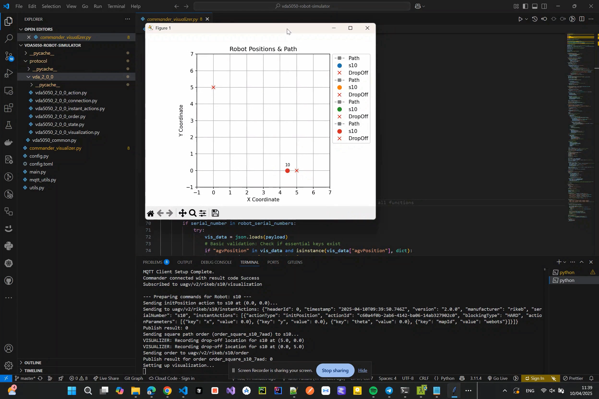

# VDA5050 Robot Simulator

Python-based simulation environment for robots with VDA 5050 protocol (specifically targeting version 2.0.0). It allows simulating multiple AGVs (Automated Guided Vehicles), sending them orders, and visualizing their movement and status via MQTT.

## Demo Video
[](https://youtu.be/wxV-e8J-8gQ)

## Features

* **VDA 5050 v2.0.0 Compliance:** Simulates key aspects of the VDA 5050 protocol including:
    * Connection states (`ONLINE`, `OFFLINE`, `CONNECTION_BROKEN`)
    * Vehicle State (`State`, `AgvPosition`, `ActionState`, etc.)
    * Order processing (`Order`, `Node`, `Edge`)
    * Instant Actions (`InstantActions`, `Action`)
    * Visualization messages (`Visualization`)
* **Multi-Robot Simulation:** Can simulate multiple AGVs concurrently, configured via `config.toml`.
* **MQTT Communication:** Uses MQTT for communication between the simulator, commander, and potentially other systems.
* **Commander & Visualizer:** Includes a separate script (`commander_visualizer.py`) to:
    * Send `initPosition` instant actions and `Order` commands to simulated robots.
    * Subscribe to `Visualization` topics and display robot positions and paths using Matplotlib.
* **Configurable:** Simulation parameters (MQTT broker details, vehicle properties, simulation speed, robot count, etc.) are managed through a `config.toml` file.
* **Modular Protocol Definitions:** VDA 5050 message structures are defined using Python dataclasses in the `protocol` directory.

## Structure

```vda5050-robot-simulator/
├── config.toml             # Configuration file (Needs to be created)
├── config.py               # Loads configuration from config.toml
├── main.py                 # Main simulator script, runs AGV instances
├── commander_visualizer.py # Sends commands and visualizes robot states
├── mqtt_utils.py           # MQTT connection and topic utilities
├── utils.py                # Helper functions (timestamps, math)
└── protocol/               # VDA5050 protocol message definitions
├── vda5050_common.py   # Common data structures
└── vda_2_0_0/          # VDA 5050 v2.0.0 specific messages
├── vda5050_2_0_0_action.py
├── vda5050_2_0_0_connection.py
├── vda5050_2_0_0_instant_actions.py
├── vda5050_2_0_0_order.py
├── vda5050_2_0_0_state.py
└── vda5050_2_0_0_visualization.py
```

## Setup

1.  **Dependencies:** 
    * `paho-mqtt` (For MQTT communication)
    * `matplotlib` (For visualization)
    * `tomli` (or `toml` for Python 3.11+) (For reading the config file)
    ```bash
    pip install paho-mqtt matplotlib tomli
    ```
2.  **Configuration:** Create a `config.toml` file in the root directory. Based on `config.py`, it should look something like this:
    ```toml
    [mqtt_broker]
    host = "your_mqtt_broker_host" # e.g., "localhost" or IP address
    port = "1883" # Default MQTT port
    vda_interface = "uagv" # Example interface name

    [vehicle]
    manufacturer = "YourCompany"
    serial_number = "SimRobot" # Base serial number, index is appended
    vda_version = "2.0.0"
    vda_full_version = "VDA5050_V2.0.0" # Matches the protocol files

    [settings]
    action_time = 2.0   # Time in seconds for simulated actions (e.g., dropOff)
    speed = 0.5         # Simulation speed (units per tick)
    robot_count = 3     # Number of robots to simulate
    state_frequency = 1 # Hz (Publish state message 1 time per second)
    visualization_frequency = 10 # Hz (Publish visualization 10 times per second)
    map_id = "map1"     # Default map ID
    ```
    *Update `mqtt_broker.host` and other settings as needed.*

## Usage

1.  **Start an MQTT Broker:** Ensure an MQTT broker is running and accessible based on your `config.toml`.
2.  **Run the Simulator:**
    ```bash
    python main.py
    ```
    This will start simulating the number of robots specified in `config.toml`. Each robot will connect to the MQTT broker and start publishing its state and visualization data.
3.  **Run the Commander/Visualizer:**
    ```bash
    python commander_visualizer.py
    ```
    This will:
    * Connect to the MQTT broker.
    * Subscribe to the visualization topics of the simulated robots.
    * Send an initial position (`initPosition`) and a sample square path `Order` to each robot.
    * Open a Matplotlib window showing the robot paths and their real-time positions.

## How it Works

* **`main.py`**: Creates multiple `VehicleSimulator` instances based on `robot_count`. Each instance runs asynchronously, managing its own state according to VDA5050 rules. It listens for `order` and `instantActions` topics and publishes `connection`, `state`, and `visualization` topics. Robot movement is simulated by incrementally updating positions towards the next node in the order. Actions like `dropOff` introduce delays.
* **`commander_visualizer.py`**: Acts as a simple master control. It sends commands (currently hardcoded square path with drop-off actions) and visualizes the data received on the `/visualization` topics for all configured robots.
* **`protocol/`**: Contains dataclasses representing the JSON structures defined by the VDA 5050 specification, making it easier to create, parse, and validate messages.
* **MQTT Topics**: Communication follows the VDA5050 topic structure: `<interface>/<version>/<manufacturer>/<serialNumber>/<topic>`.
